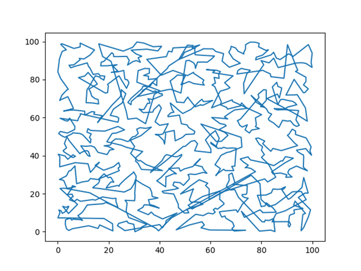

# Traveling Salesman Problem

## 1. INTRODUCTION

TSP의 해를 유전 알고리즘을 이용해 구하기 위해서 몇 가지 방법을 제안하고, 프로그램으로 구현해서 비교한다.
비교할 방법들은 다음과 같다.

1.	완전 무작위로 도시의 순서를 정함
2.	유전 알고리즘만을 사용해서 도시의 순서를 정함
3.	전체 공간을 몇 개의 도시로 이루어진 클러스터로 나눈 뒤, 그 클러스터의 순서를 유전 알고리즘을 사용해 결정함

---

## 2. MAIN STRUCTURE
* 완전 무작위로 도시의 순서 정하기

완전 무작위로 정해진 도시 방문 순서는 대조군으로, 상당히 좋지 않은 결과가 나타날 것으로 예상된다.  
앞으로 설명할 알고리즘의 일차적 목표는 이 방법으로 정해진 도시 방문 순서보다 빨라야 한다는 것이다.

* 유전 알고리즘만을 사용해서 도시의 순서 정하기

유전 알고리즘을 사용해서 도시의 순서를 정하기 위해서 제시할 방법은 다음과 같다. 
우선, 초기값으로 완전 무작위로 정해진 도시의 순서를 사용한다. 
여기에서 염색체는 각 도시이고, 염색체의 순서가 달라짐으로써 그 상태에서의 결과값이 달라지게 된다. 

유전자를 섞는 방법은 다음과 같다.

1.	모든 도시에서 양 옆 도시까지의 거리 평균을 구한다
2.	양 옆 도시까지의 거리가 먼 n개의 도시를 현재 도시 순서에서 끊어낸다(섞을 유전자)
3.	연결이 끊어진 도시들을 양 옆 노드들간의 거리가 가까운 순서로 집어넣는다.

앞으로 이 일련의 과정을 한 번 수행하는 것을 “한 세대” 라고 하겠다. 
이 과정에서 좋지 않은 유전자 순으로 탈락하고, 그 탈락한 유전자들이 가질 수 있는 가장 좋은 형태로 다시 들어오게 된다. 
또한 돌연변이를 구현해 초기값이 조금 불리하게 나왔더라도, 많은 세대를 거친 후에는 값이 최대한 수렴할 수 있도록 구현했다. 
돌연변이는 유전자를 섞을 때 양 옆 도시까지의 거리를 고려하지 않고 랜덤하게 n개의 도시를 순서에서 끊어내는 방식으로 구현했다. 
결과값은 여러 세대를 거치는 도중 그 중에서 가장 짧았던 경로로 정했다. 

* 클러스터링 후 클러스터를 배열하기

최적해에 가까운 tsp를 구하기 위해 제안하는 방식이다. 
이 방법은 도시 1000개로 이루어진 공간을 여러 개의 도시 집합(이하 클러스터)들로 나눈다. 
그리고 그 도시 집합들의 순서 배열을 유전 알고리즘으로 찾아가는 식으로 전체 도시 순서를 구하게 된다. 

우선 클러스터를 나누는 방법에 대해서 먼저 이야기하도록 하겠다. 클러스터를 나누는 방법에 관한 4가지 아이디어가 있다.  이하는 그 4가지 아이디어다.

1.	완전 무작위로 클러스터 나누기
2.	K-means로 클러스터 나누기
3.	각 클러스터별 최소 스패닝 트리의 길이 합이 최소가 되도록 클러스터 나누기
4.	각 클러스터별 최소 해밀턴 순환 길이 합이 최소가 되도록 클러스터 나누기

완전 무작위로 클러스터를 나누는 방법은 전체 도시들을 크기가 10인 클러스터 100개로 나눈다. 
클러스터의 크기를 10으로 한 것은 클러스터를 배열할 때 해밀턴 경로 정보가 필요한데, 크기가 10이면 해밀턴 경로를 구할 때  계산량이10! 정도로 큰 어려움 없이 계산할 수 있기 때문이다.

k-means로 클러스터를 나누는 방법은 다른 방법들과는 다른 특징이 있다. 
바로 클러스터의 크기가 다양하게 나타난다는 것이다. 
프로그램을 몇 번 수행한 결과, 가장 작은 클러스터 크기는 3, 가장 큰 클러스터 크기는 20정도로 나타나는 것을 알 수 있었다. 
이 떄문에 이 방법에는 문제가 있는데, 최대 클러스터 크기가 20 근처로, 이후 클러스터 배열을 위한 최적 해밀턴 경로 계산이 불가능하다는 것이다. 
따라서 k-means 클러스터링은 사용하지 않기로 했다. 

그 다음으로 최소 스패닝 트리의 길이 합이 가장 작게 클러스터링하는 방법, 최소 해밀턴 순환의 값의 합이 가장 작게 클러스터링하는 방법이 있는데, 이 두 방법은 클러스터 내부 경로만 다를 뿐 원리는 같으므로 한꺼번에 설명하도록 하겠다. 
처음에는 랜덤하게 클러스터를 나누고 이 값을 초기값으로 사용한다. 그 후 유전 알고리즘을 사용해서 클러스터를 최적화해 나간다.  상세 절차는 다음과 같다. 
1.	 각 클러스터별로 최소 스패닝 트리 / 최소 해밀턴 순환을 구한다 
2.	각 클러스터별로 옆 도시와 거리 평균이 가장 큰 도시 n 개를 클러스터에서 제외한다 
3.	제외된 도시들을 자리가 빈 클러스터 중 가장 거리가 가까운 도시가 포함된 클러스터에 집어넣는다

이 과정을 한 세대로 보고, 약 3만세대정도를 계산해서 그 중 가장 좋은 값을 결과로 내놓게 된다. 
또한 초기값에 결과값이 영향을 크게 받는 것을 어느정도 방지하기 위해 돌연변이를 도입했는데, 돌연변이는 위의 2번 절차 전에 랜덤하게 n개의 도시를 클러스터에서 떼어놓는 것으로 구현했다.

위 방법대로 클러스터링한 결과를 가지고 그 클러스터들의 배열을 찾아, 최종적인 결과를 내게 된다. 클러스터들의 최적 배열을 찾는 방법은 다음과 같다. 
1.	우선 전처리로써, 각 클러스터의 [시작점][끝점] 마다 최적의 해밀턴 경로를 구한다. 이는 클러스터 사이의 연결점을 구했을 때, 클러스터 내부의 최적 해밀턴 경로를 바로 구할수 있게 하기 위해서이다.
2.	모든 양옆 클러스터에 대해서 연결점을 구한다. 연결점은 두 클러스터에서 가장 가까운 두 점이다. 클러스터 사이의 거리는 이 연결점 사이의 거리이다.
3.	클러스터별로 양옆 클러스터와의 거리 평균 및 내부 최소 해밀턴 경로를 구한다.
4.	양 옆 클러스터와의 거리 합 + 내부 경로 길이가 가장 먼 n개의 클러스터를 옆 클러스터와 연결을 끊는다.
5.	연결이 끊어진 클러스터들을 양 옆 클러스터와의 거리 합 + 내부 해밀턴 경로 길이가 가장 작은 위치에 집어넣는다.
6.	이후 2번부터 반복한다.

위의 2-6 과정을 한 세대로 보고, 3만세대정도를 계산한 뒤 그 중 최종 해밀턴 순환 길이가 가장 작은 도시 순서를 결과 파일로 내놓는다. 
또한 클러스터 순서 배열에서도 돌연변이를 구현했는데, 돌연변이는 위의 3번 과정 이후 랜덤하게 n개의 클러스터를 양 옆 클러스터에서 떨어뜨려 놓는 방식으로 구현되어 있다. 
이 방법으로 tsp 경로 탐색을 하게 될 경우, 클러스터링 과정에서 부분 최적 해를 구해놓기 때문에 완전 무작위 탐색을 물론, 유전 알고리즘만을 사용한 방법에 비해서도 상당한 성능 향상이 있을 것이라고 생각된다. 
또한 양 옆 클러스터에서 가장 먼 클러스터를 떼어낸 후 가장 가까워질 수 있는 곳에 삽입하는 형식이다 보니 세대 수를 길게 할 수록 최적해에 가까워질 것이라고 생각된다.

---

## 3. EXPERIMENTAL RESULTS
완전 무작위, 전체 도시 대상 유전 알고리즘 실행, 랜덤 클러스터링 후 클러스터 대상 유전 알고리즘 실행, 최소 스패닝 트리 기반 클러스터링 후 클러스터 대상 유전 알고리즘 실행, 최소 해밀턴 경로 기반 클러스터링 후 클러스터 대상 유전 알고리즘 실행을 각각 5회씩 했을 때,  그 결과값(순환의 길이)은 다음과 같다.

 

|완전 무작위|전체 유전 알고리즘|랜덤 클러스터링|최소 스패닝 트리 클러스터링|최소 해밀턴 경로 클러스터링|
|------:|---:|---:|---:|---:|
|53176.03214|5853.197296|24176.387481|3597.931049|4995.500407|
|53303.81974|5368.142632|24072.427228|3391.611106|5477.151865|
|52406.03474|5709.056035|24023.431297|3447.291341|5728.613889|
|53257.09959|5495.127366|24091.554285|3243.344138|5539.289516|
|52914.11712|5895.196555|23984.545605|3785.817537|5863.585740|

표1. 실험 결과
 
 

완전 무작위로 도시 순회 순서를 결정했을 때에는 순환 경로 길이가 약 5만정도의 값이 나타난다. 
완전 무작위지만 5만정도의 값이 계속 나온다는 건 특이한 점이라고 생각한다. 
그 다음으로 결과가 좋은 방식은 랜덤으로 클러스터링 후, 유전 알고리즘으로 클러스터의 순서를 정하는 방법이다. 
이 방식은 순환 경로 길이가 약 2만4천정도로, 완전 무작위에 비하면 두배정도 성능이 좋아졌다. 
이 방법은 클러스터가 무작위로 생성되어 그 내용을 바꿀 수 없다는 결정적인 단점이 있어서 다른 유전 알고리즘을 사용한 방법들에 비해서 성능이 좋지 않게 나타났다고 생각한다. 
전체 유전 알고리즘과 최소 해밀턴 경로 클러스터링 방법은 결과가 유사하게 나왔다. 
유전 알고리즘만을 사용한 방법은 5천 초중반,  해밀턴 경로 기준으로 클러스터링 후 유전 알고리즘을 사용한 방법은 마찬가지로 5천 초중반정도의 결과가 나타난다. 
하지만 이 차이는 양쪽 다 한 세대당 주변과 떨어지는 도시의 수, 돌연변이 유무 및 정책 등의 세부 파라미터에 의해 더욱 좁혀지거나 심지어는 뒤집힐 수도 있는 차이라고 생각한다. 
가장 성능이 좋은 걸로 나타난 방법은 최소 스패닝 트리 방식 클러스터링이다. 이 방법은 약3천 중반정도의 경로 값을 가지며 다른 방법들과 크게 차이를 벌렸다. 
이 방식으로 찾아낸 최소 경로 길이 값은 3243.344138 이며, 시각화하여 나타내면 다음과 같다. 
 
 

 
그림 1. 최소 경로 값 시각화 이미지

 ---

## 4. DISCUSSION AND CONCLUSION
처음 방법들을 구상했을 때에는 가장 좋은 결과를 내는 방법은 최소 스패닝 트리 방식 클러스터링이나, 최소 해밀턴 경로 방식 클러스터링일 것이라 예상했다. 
테스트 결과는 최소 스패닝 트리 방식 클러스터링이 가장 좋은 성과를 냈다. 
최소 해밀턴 경로 방식 클러스터링은 클러스터 내부 경로 중 가장 짧은 쪽을 최적화하지만, 최소 스패닝 트리 방식 클러스터링은 클러스터 내부 경로 길이 합의 평균을 최적화하기 때문에 위와 같은 결과가 나타났다고 생각한다.
